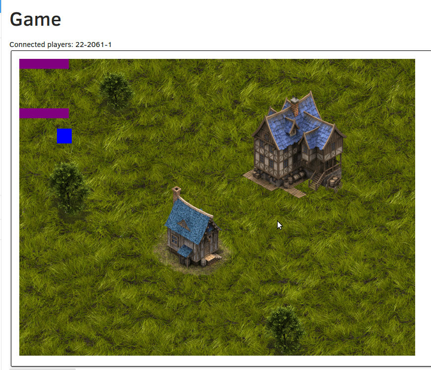

# SWAP 2021 - Hackathon

V rámci školení SWAP vznikl herní engine postavený na SpringBootu. 

- v prvním běhu měla vzniknout hra inspirovaná bulánky (v master branci)
- v druhém běhu vznikla hra na motiv Soldatu ([v branchi `Soldat`](https://github.com/petrfilip/uu_game_maing01/tree/Soldat))

| Soldat  | Bulánci |
| ------------- | ------------- |
|  |   |

## Inicializace aplikace

V insomnii a v application.properties upravit údaje a `asidLicenseOwnerList`, `awidLicenseOwner` a `token`.
Token je na https://uuidentity.plus4u.net/. 

Zavolat uuCmds nad běžící aplikací:
- sys/uuSubAppInstance/init
- sys/uuAppWorkspace/create
- sys/uuAppWorkspace/init
- aplikace běží na http://localhost:8080/uu-game-maing01/22222222222222222222222222222222/

Pro vývoj GUI je potřeba ještě spustit `npm start` v adresáři `*-hi`. 

Hudba: https://gamesounds.xyz/?dir=OpenBundle/Background%20Music%20and%20Loops

Assety: https://opengameart.org/ & https://remos.itch.io/timbered-house | https://itch.io/game-assets/free/tag-animation | https://www.gamedevmarket.net/category/2d/page/2/?type=free | https://tokegameart.net/category/freebies/

# Development and Usage

See following guidelines:

- [uuAppg01Devkit Documentation](https://uuapp.plus4u.net/uu-bookkit-maing01/e884539c8511447a977c7ff070e7f2cf/book)
- [uuSubApp Instance Descriptor](https://uuapp.plus4u.net/uu-bookkit-maing01/289fcd2e11d34f3e9b2184bedb236ded/book/page?code=uuSubAppInstanceDescriptor)
- [uuApp Server Project (Java)](https://uuapp.plus4u.net/uu-bookkit-maing01/99c939a08e0849c68df5ee339c94054b/book/page?code=uuAppStyleGuide_00)
- [uuApp Client Project (UU5)](https://uuapp.plus4u.net/uu-bookkit-maing01/ed11ec379073476db0aa295ad6c00178/book/page?code=getStartedHooks)

- běží na http://localhost:8080/uu-game-maing01/22222222222222222222222222222222/
- přidán docker s databází (volitelné)
- přidán gradle wrapper 5.1.1
