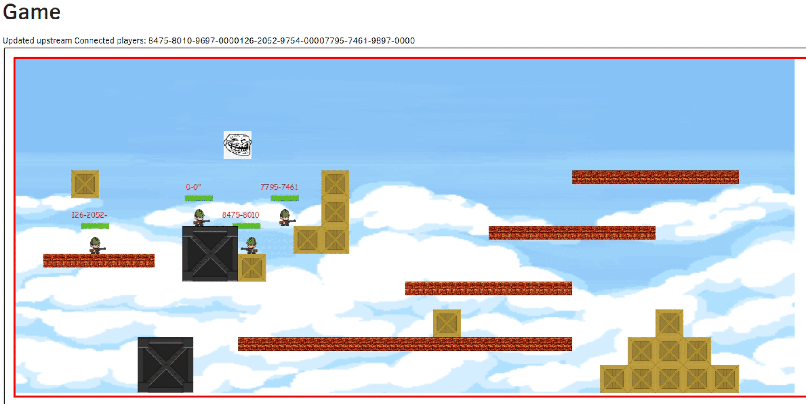

# SWAP 2021 - Soldat Hackaton

Demo se zvuky: [https://www.youtube.com/watch?v=iRQiGY0veIs](https://www.youtube.com/watch?v=iRQiGY0veIs)

# **Soldat Nevolution**

- Relativně realtime
- Střílení myší
- "Náhodně" generovaná mapa
- Respawn hráče
- Bonusy (Nesmrtelnost, Zvýšená rychlost, Freeze hráčů, Přidání života, Zrychlení hráče)
- Herní módy (Time limit, Score limit)
- ELO + LeaderBoard
- Audio grafický masterpiece (Life bar + id hráče, Stav hráče)

**Technické overview**

-   Java
-   HTML Canvas (nestandard)
- SSE (nestandard)
- Posílání stavu + speciálních event
- Klient posílá pohyb (neposílá souřadnice - výpočet na serveru)
- Univerzální engine
- Modulární koncept
- Snadná rozšiřitelnost (intefaces všude)
- InMemory místnosti (inMemory DAO)
- Ukládáme pouze uuIdentity + score

**Co ještě chybí**

- Ze základní funkčnosti snad nic
- Ale ještě by se dalo vylepšovat
- Žádné testy
- Spousta úžasných bugů
- Loby pro konfiguraci hry 

**Možná technologická vylepšení**
- Více canvasů pro pro různé vrstvy (pozadí X hráči)
- Optimalizace přenesených dat (minifikace JSON, rozdělení na více částí)
- Přidání animací
- Lepší interpolace pohybu hráče a kulky

# Tým:

- Lukáš
- Petr
- Petr

## Inicializace
V insomnii a v application.properties upravit údaje a `asidLicenseOwnerList`, `awidLicenseOwner` a `token`.
Token je na https://uuidentity.plus4u.net/. 

Zavolat uuCmds nad běžící aplikací:
- sys/uuSubAppInstance/init
- sys/uuAppWorkspace/create
- sys/uuAppWorkspace/init
- aplikace běží na http://localhost:8080/uu-game-maing01/22222222222222222222222222222222/

Pro vývoj GUI je potřeba ještě spustit `npm start` v adresáři `*-hi`. 

Hudba: https://gamesounds.xyz/?dir=OpenBundle/Background%20Music%20and%20Loops | [Worms realtime](https://visiongame.cz/hra/worms-realtime/)

Assety: https://opengameart.org/ & https://remos.itch.io/timbered-house | https://itch.io/game-assets/free/tag-animation | https://www.gamedevmarket.net/category/2d/page/2/?type=free | https://tokegameart.net/category/freebies/

# Development and Usage

See following guidelines:

- [uuAppg01Devkit Documentation](https://uuapp.plus4u.net/uu-bookkit-maing01/e884539c8511447a977c7ff070e7f2cf/book)
- [uuSubApp Instance Descriptor](https://uuapp.plus4u.net/uu-bookkit-maing01/289fcd2e11d34f3e9b2184bedb236ded/book/page?code=uuSubAppInstanceDescriptor)
- [uuApp Server Project (Java)](https://uuapp.plus4u.net/uu-bookkit-maing01/99c939a08e0849c68df5ee339c94054b/book/page?code=uuAppStyleGuide_00)
- [uuApp Client Project (UU5)](https://uuapp.plus4u.net/uu-bookkit-maing01/ed11ec379073476db0aa295ad6c00178/book/page?code=getStartedHooks)

- běží na http://localhost:8080/uu-game-maing01/22222222222222222222222222222222/
- přidán docker s databází (volitelné)
- přidán gradle wrapper 5.1.1
